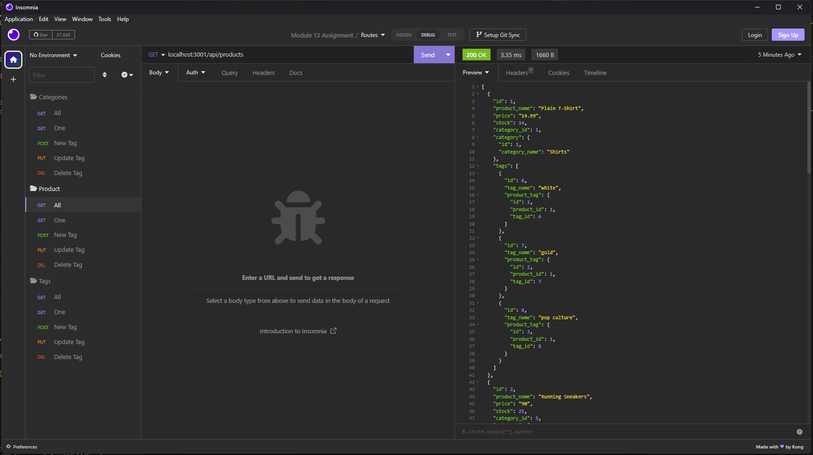
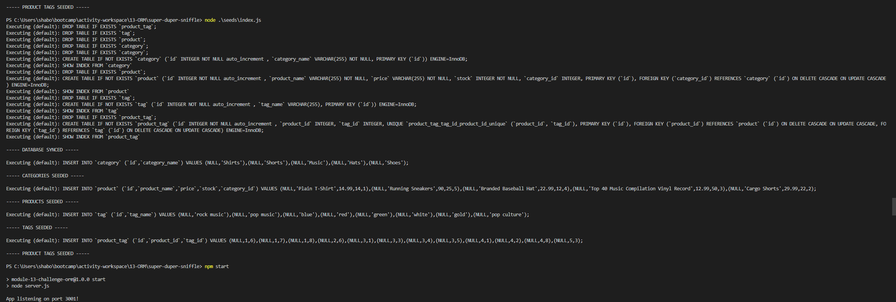

](https://opensource.org/licenses/MIT)

# E-Commerce Back-End

## Description

This application is a commerical product tracker for local usage.

\

## Table of Contents

[Installation](#Installation) |
[Usage](#Usage) |
[Credits](#Credits) |
[License](#License) |
[Features](#Features) |
[How To Contribute](#How-To-Contribute) |
[Tests](#Tests)

## Installation

Pull Repository to Local and Run in Terminal

## Usage

Application Type: Terminal Based Program with Insominia Functionality

Run:\
`npm i`\
`node .\seeds\index.js`\
`npm start`

Tutorial Link:
https://drive.google.com/file/d/1puZ9-9fkGqshJZeT0ioCBu24CvohGo3b/view?usp=sharing

## Credits

Sean Haboon, Alexandr Peters, Chris Snyder

License Badges Taken From:

Lukas Himsel
https://gist.github.com/lukas-h/2a5d00690736b4c3a7ba

## License

https://www.mit.edu/~amini/LICENSE.md

      MIT License

      Copyright (c) [2023] [Sean Haboon]

      Permission is hereby granted, free of charge, to any person obtaining a copy
      of this software and associated documentation files (the "Software"), to deal
      in the Software without restriction, including without limitation the rights
      to use, copy, modify, merge, publish, distribute, sublicense, and/or sell
      copies of the Software, and to permit persons to whom the Software is
      furnished to do so, subject to the following conditions:

      The above copyright notice and this permission notice shall be included in all
      copies or substantial portions of the Software.

      THE SOFTWARE IS PROVIDED "AS IS", WITHOUT WARRANTY OF ANY KIND, EXPRESS OR
      IMPLIED, INCLUDING BUT NOT LIMITED TO THE WARRANTIES OF MERCHANTABILITY,
      FITNESS FOR A PARTICULAR PURPOSE AND NONINFRINGEMENT. IN NO EVENT SHALL THE
      AUTHORS OR COPYRIGHT HOLDERS BE LIABLE FOR ANY CLAIM, DAMAGES OR OTHER
      LIABILITY, WHETHER IN AN ACTION OF CONTRACT, TORT OR OTHERWISE, ARISING FROM,
      OUT OF OR IN CONNECTION WITH THE SOFTWARE OR THE USE OR OTHER DEALINGS IN THE
      SOFTWARE.

## Features

This application features Express.js and MySQL.

## How to Contribute

Contributors may fork the repository using the given link and create a Pull Request. There are no limitations on what someone may modify or use.
https://github.com/shaboon/super-duper-sniffle.git

## Tests

N/A
